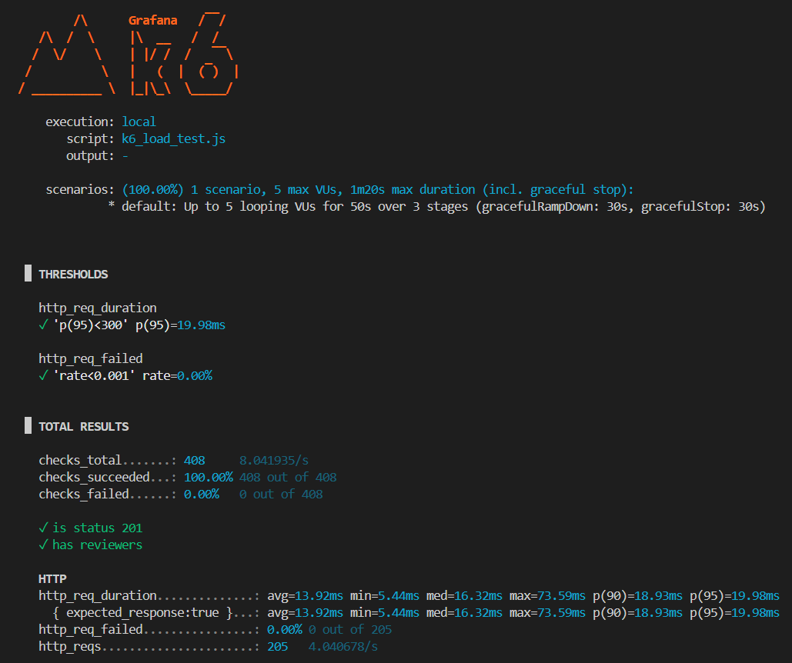

# PR Reviewer Assignment Service

Avito backend trainee assignment. Go microservice for automatically assigning reviewers to Pull Requests based on team membership, availability, and workload distribution. I prefer to write documentation in English, I hope it's okay :)

## Features

*   **Automatic Reviewer Assignment**: Randomly selects up to 2 active reviewers from the author's team (excluding the author).
*   **Team & User Management**: Manage teams, active status, and assignments.
*   **Smart Reassignment**: safely replace a reviewer with another active team member if they are unavailable.
*   **Bulk Operations**: Handle team departures gracefully by bulk-deactivating users and automatically reassigning their open reviews in a single transaction.
*   **Idempotent Operations**: Safe retry mechanisms for critical actions like merging.
*   **Statistics**: Real-time insights into system usage and reviewer workload.
*   **Performance**: optimized for low latency (<300ms) and high concurrency.

## Tech Stack

*   **Language**: Go 1.25
*   **Database**: PostgreSQL 15
*   **Driver**: `pgx/v5`
*   **Containerization**: Docker & Docker Compose
*   **Testing**: Integration tests with real DB, k6 for load testing.

## Project Structure

```text
.
├── cmd
│   └── server
│       └── main.go           # Entry point: Router, DB connection, Server
├── internal
│   ├── api                   # HTTP Handlers (Controllers)
│   │   ├── handler.go        # Shared response helpers
│   │   ├── team_handler.go   # /team/* endpoints
│   │   ├── user_handler.go   # /users/* endpoints
│   │   ├── pr_handler.go     # /pullRequest/* endpoints
│   │   └── stats_handler.go  # /stats endpoint
│   ├── model
│   │   └── types.go          # Structs for JSON requests and DB entities
│   └── store                 # Database Access Layer (Repository)
│       ├── store.go          # DB setup & Interface
│       ├── team_store.go     # Team & Bulk logic
│       ├── user_store.go     # User status logic
│       ├── pr_store.go       # PR creation, merge, and assignment logic
│       └── stats_store.go    # Statistics aggregation
├── migrations
│   └── 001_init.sql          # Database Schema & Indexing
├── tests                     # Integration Test Suite
│   ├── setup_test.go         # Test DB helpers
│   ├── team_test.go          # Team logic tests
│   ├── pr_test.go            # Assignment logic tests
│   └── stats_test.go         # Statistics tests
├── k6_load_test.js           # Load testing script
├── Dockerfile                # Application build definition
└── docker-compose.yml        # Full stack orchestration
```

## Getting Started

### Running the Service

#### 1. Start the Stack:

```bash
docker-compose up --build
```

#### 2. Verify: 

Visit `http://localhost:8080/health` to check if the service is running


## API Reference

The API runs on `localhost:8080`

### Teams & Users

| Method | Endpoint | Description |
| :--- | :--- | :--- |
| `POST` | `/team/add` | Create a new team or update members. |
| `GET` | `/team/get?team_name=...` | Get team details and members. |
| `POST` | `/users/setIsActive` | Enable/Disable a user (affects eligibility). |
| `POST` | `/team/bulkDeactivate` | **Advanced**: Deactivate multiple users and auto-reassign their reviews. |
| `GET` | `/users/getReview?user_id=...`| List PRs assigned to a user. |

### Pull Requests

| Method | Endpoint | Description |
| :--- | :--- | :--- |
| `POST` | `/pullRequest/create` | Create PR & Auto-assign reviewers. |
| `POST` | `/pullRequest/merge` | Mark PR as merged (Idempotent). |
| `POST` | `/pullRequest/reassign` | Replace a specific reviewer with a new random candidate. |

### Observability

| Method | Endpoint | Description |
| :--- | :--- | :--- |
| `GET` | `/stats` | Get system metrics (users, active PRs, busiest reviewers). |
| `GET` | `/health` | Simple health check. |


## Testing

### Integration tests

The project includes a comprehensive integration test suite that runs against a live database.

**Note:** Running tests locally requires a running Postgres instance on port 5432 (provided by docker-compose). Warning: Running tests will TRUNCATE existing data in the local database.

```bash
go test -v -count=1 ./tests
```

### Load Testing

The project contains the file `k6_load_test.js` I used to verify the SLI. I will only attech the results of testing:




## Logic & Business Rules

### 1. Auto-Assignment:

- Finds candidates in the author's team.
- Filters for is_active = true.
- Excludes the PR author.
- Randomly selects up to 2 reviewers.
- If < 2 candidates exist, assigns whoever is available.

### 2. Reassignment:

- Only allowed on OPEN PRs.
- The old reviewer must currently be assigned.
- The new candidate is selected randomly from the - team, excluding the author and existing reviewers.

### 3. Bulk Deactivation

- Executed in a single ACID transaction.
- Sets target users to inactive.
- Scans all OPEN PRs assigned to them.
- Immediately finds replacements for every affected review to ensure no PR is left "orphaned".

